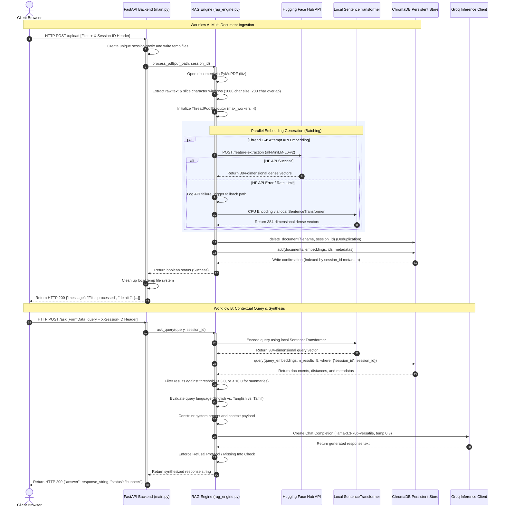
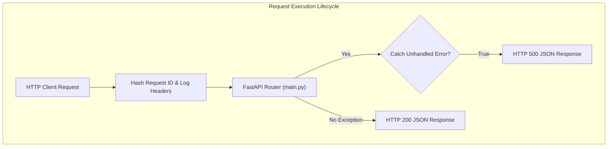
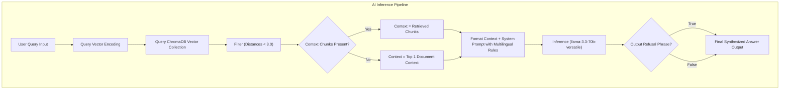
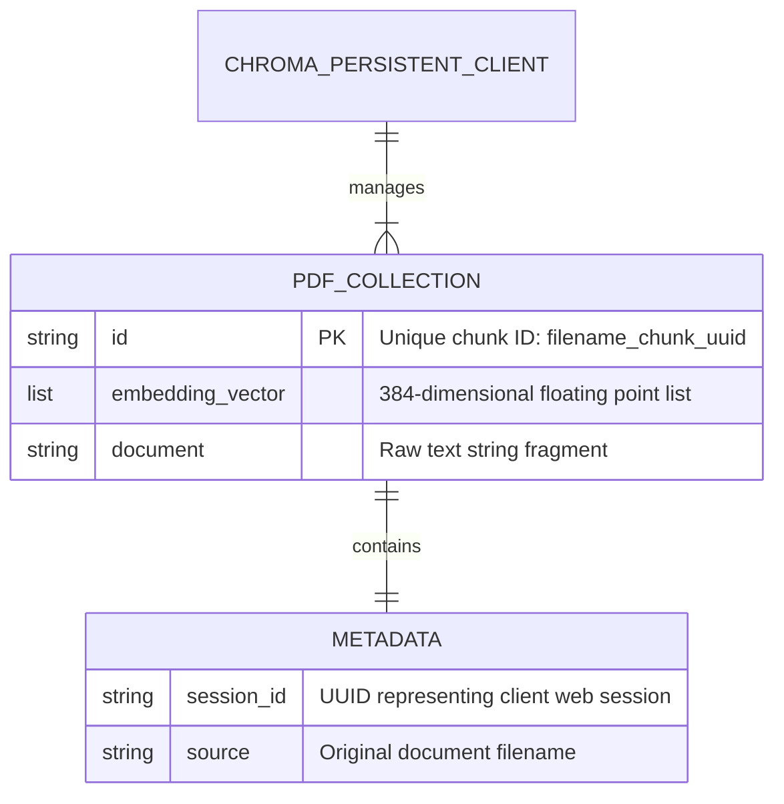

# DocParseAI

DocParseAI is an academic research and study assistant that utilizes a Retrieval-Augmented Generation (RAG) pipeline to enable conversational intelligence over uploaded documents. It is structured as a decoupled two-tier architecture consisting of a Python/FastAPI backend analytical engine and a Next.js React/TypeScript frontend user interface.

The system provides session-isolated knowledge ingestion, enabling users to upload multiple PDF documents and query them with contextual relevance. The analytical pipeline incorporates local and remote embedding generation, a persistent vector database, and high-throughput LLM inference for precise and factually grounded responses.

---

## Architecture Overview

DocParseAI is engineered around a synchronous analytical pipeline that connects a reactive client to a session-isolated vector intelligence engine. The following diagram illustrates the component topology and data transport paths:

```mermaid
graph TD
    subgraph Client ["Client Tier (Next.js Application)"]
        UI["React SPA (src/app/page.tsx)"]
        Config["API Configuration (src/config/api.ts)"]
        UI -->|Axios/Fetch| Config
    end

    subgraph Gateway ["Routing & Proxy Tier"]
        Proxy["Next.js Rewrite Proxy (Dev: /api/*)"]
        Render["Render CDN Gateway (Prod: https://documind-ai-yhp8.onrender.com)"]
    end

    subgraph AnalyticalEngine ["Server Tier (FastAPI Engine)"]
        App["API Gateway (main.py)"]
        Middleware["Logging & CORS Middlewares"]
        Engine["RAG Core (rag_engine.py)"]
        
        App --> Middleware
        Middleware --> Engine
    end

    subgraph ExternalServices ["External Intelligence Tier"]
        HF["Hugging Face Inference Hub API"]
        Groq["Groq API Server"]
    end

    subgraph Storage ["Persistence Tier"]
        Chroma["ChromaDB Vector Store (chroma_db/)"]
        LocalModel["SentenceTransformer (all-MiniLM-L6-v2)"]
    end

    UI -->|Localhost Proxy| Proxy
    UI -->|Direct HTTPS| Render
    Proxy -->|Localhost Port 8000| App
    Render -->|Cloud Target| App

    Engine -->|Primary: Embeddings Request| HF
    Engine -->|Fallback: Local CPU Embeddings| LocalModel
    Engine -->|Vector Persist & Retrieval| Chroma
    Engine -->|LLM Synthesis Request (llama-3.3-70b-versatile)| Groq
```

---

## End-to-End Processing Flow

The processing cycle operates through two primary workflows: Document Ingestion and Contextual Query/Synthesis. The sequence diagram below demonstrates the precise execution paths, thread utilization, and transaction states across both operations:



---

## Technology Stack

The technology stack is divided into specific application layers. It represents only dependencies actively configured and integrated within this repository:

| Layer | Technology | Primary Package/Service | Purpose |
| :--- | :--- | :--- | :--- |
| **Frontend** | React 18 | `react` & `react-dom` | Single Page Application UI component tree |
| **Frontend** | Next.js 14 | `next` (App Router) | Server-side development proxy and page routing |
| **Frontend** | CSS & Layout | `tailwindcss` | Utility-first styling framework and custom scrollbars |
| **Frontend** | Markdown Engine | `react-markdown` | Client-side rendering of structured responses |
| **Frontend** | Math Rendering | `remark-math` & `rehype-katex` | Scientific LaTeX formatting parsing and display |
| **Backend** | API Engine | `fastapi` | High-performance asynchronous routing gateway |
| **Backend** | Server Engine | `uvicorn` | ASGI server implementation for FastAPI |
| **Backend** | Parser Engine | `pymupdf` (fitz) | High-speed, robust PDF raw-text extraction |
| **Backend** | Embeddings | `sentence-transformers` | Client-side CPU-based vectorization (all-MiniLM-L6-v2) |
| **Backend** | Vector DB | `chromadb` | Persistent local serverless database engine |
| **Backend** | LLM Gateway | `groq` | External low-latency serverless model inference |
| **Backend** | API Hub Client | `huggingface_hub` | Remote embedding API server client |
| **Infrastructure** | Containerization | Docker | Build packaging container with pre-cached models |
| **Infrastructure** | Server Host | Render | Production environment deployment host |

---

## Implemented Features

### Session-Isolated Vector Multi-Tenancy
- **Description**: Isolates knowledge bases between concurrent client sessions without requiring account authentication.
- **Internal Implementation**: Generates a cryptographically strong UUIDv4 on client initialization and stores it in `localStorage` as `docparse_session_id`. Every analytical request carries this ID in the `X-Session-ID` HTTP header. The backend assigns this session identifier to ChromaDB metadata records and restricts queries via the vector database's metadata filtering mechanics: `where={"session_id": session_id}`.
- **Relevant Modules**: [src/app/page.tsx](file:///home/nataraj/old_laptop_backup/Documents/DocParse%20AI/frontend/src/app/page.tsx#L70-L92), [backend/main.py](file:///home/nataraj/old_laptop_backup/Documents/DocParse%20AI/backend/main.py#L116), [backend/rag_engine.py](file:///home/nataraj/old_laptop_backup/Documents/DocParse%20AI/backend/rag_engine.py#L286-L292).

### Dual-Strategy Embedding Pipeline
- **Description**: Robust embedding calculation using remote APIs with automatic offline, local-compute fallback.
- **Internal Implementation**: The ingestion pipeline utilizes a multi-threaded parallel executor (`ThreadPoolExecutor`). Each thread attempts to reach Hugging Face Hub's API to calculate embeddings remotely. If the request encounters rate limits or connection errors, the system intercepts the exception and invokes the local `SentenceTransformer` instance to process the chunk locally using CPU instruction sets.
- **Relevant Modules**: [backend/rag_engine.py](file:///home/nataraj/old_laptop_backup/Documents/DocParse%20AI/backend/rag_engine.py#L83-L136).

### Adaptive Multilingual Intelligence
- **Description**: Intelligently routes and synthesizes LLM outputs into Tanglish, pure Tamil, or standard English based on user query intent.
- **Internal Implementation**: The context synthesizer evaluates the user's input against linguistic trigger rules:
  - **Default**: Responds strictly in English.
  - **Tanglish Rule**: If Tamil script or colloquial Tanglish terminology is identified, it responds in spoken Tamil syntax containing English technical vocabulary.
  - **Pure Tamil (Senthamil)**: Triggered only when explicitly prompted with keywords like "pure Tamil" or "Senthamil-la sollu".
  - **Negative Constraints**: Strictly forbids dual-language output (English followed by a translated version). If the document content does not answer the question, a rigid refusal message is rendered in the matched language mode.
- **Relevant Modules**: [backend/rag_engine.py](file:///home/nataraj/old_laptop_backup/Documents/DocParse%20AI/backend/rag_engine.py#L323-L407).

### Mathematical LaTeX Layout Rendering
- **Description**: Parses mathematical notations in retrieved document chunks and renders high-fidelity scientific formats.
- **Internal Implementation**: The system prompts the LLM to format mathematical formulas in standard inline (`$E=mc^2$`) and block (`$$E=mc^2$$`) LaTeX scripts. The Next.js frontend intercepts the raw markdown and processes it through `remark-math` and `rehype-katex` plugins inside the virtual DOM.
- **Relevant Modules**: [frontend/src/app/page.tsx](file:///home/nataraj/old_laptop_backup/Documents/DocParse%20AI/frontend/src/app/page.tsx#L383-L428), [backend/rag_engine.py](file:///home/nataraj/old_laptop_backup/Documents/DocParse%20AI/backend/rag_engine.py#L333).

---

## Backend Architecture

The backend is built as a single FastAPI microservice configured for maximum horizontal scale and low response latency.



### Key Analytical Subsystems

#### 1. API Controllers (`backend/main.py`)
- Manages HTTP endpoint declarations, route decorators, request validation parameters, CORS rules, and custom request logging middleware.
- Validates the presence of the mandatory `X-Session-ID` header.

#### 2. Vector Analytical Engine (`backend/rag_engine.py`)
- **PyMuPDF Document Ingestion**: Bypasses slow CLI dependencies by directly wrapping raw C++ PDF parsing logic via `fitz`. It extracts text page-by-page, filters empty layouts, and creates a sequential text string.
- **Overlapping Chunker**: Slices raw strings into overlapping character blocks (`chunk_size = 1000`, `overlap = 200`). This overlap ensures that semantic concepts spanning boundary lines are not severed.
- **Vector Persist and Ingest Execution**: Checks for existing collection entries matching the unique filename and session, purges them to prevent indexing duplication, and generates UUID-keyed vector chunks.

#### 3. Request Logging & Exception Middleware
- Evaluates incoming request headers and generates a unique Request ID by hashing system timestamps.
- Wraps downstream routing inside a try-catch block. If an unhandled exception triggers anywhere inside the backend, the middleware intercepts the call, formats a traceback log to stdout, and compiles a structured 500 JSON payload detailing the internal exception message and request ID.

---

## AI Orchestration Architecture

The prompt composition and model execution pipeline are configured to maintain factual alignment with uploaded sources.



### Abstraction Mechanics
- **Groq API Inference Integration**: Interacts directly with the Groq serverless client. The system specifies low-temperature configurations (`temperature=0.3`, `top_p=0.85`) to optimize deterministic factual synthesis over creative output.
- **Semantic Distance Thresholding**: During context retrieval, it calculates cosine distances. Only document chunks with a calculated distance of `< 3.0` are packed into the contextual prompt (or `< 10.0` for query strings explicitly requesting summaries). If zero chunks meet the distance requirements, it defaults to inserting the single highest scoring contextual block, ensuring the LLM always has source data to prevent hallucinations.
- **Factual Refusal Enforcement**: If the context window lacks sufficient answer telemetry, the system prompt commands the model to output a strict factual refusal string depending on the selected language mode. The post-processing loop inspects the LLM response. If this refusal string is present, it strips all other synthesized text to present a unified refusal screen.

---

## Database Design

DocParseAI relies on a local persistent instance of **ChromaDB**. It does not use any relational databases, SQL structures, or migrations.



### Storage Schema & Constraints
- **Collection Name**: `pdf_collection`
- **Primary Database Engine**: ChromaDB `PersistentClient` targeting the local database folder `chroma_db/`.
- **Database Index Constraints**:
  - `id`: Unique primary key generated as `f"{filename}_chunk_{uuid.uuid4()}"`.
  - `embeddings`: High-dimensional float array storing dense vector calculations from `all-MiniLM-L6-v2`.
  - `metadatas`: Encapsulates a structured JSON schema containing:
    - `session_id` (used as a multi-tenant isolation key).
    - `source` (tracks origin file names).
  - `documents`: Stores raw text blocks containing the chunk content.

---

## API Documentation

The backend service hosts a RESTful HTTP API. Authentication is managed via custom request headers.

### HTTP Headers
All operational endpoints require the following custom header:
- `X-Session-ID` (string, Required): The client session token used to isolate document access and vector retrieval.

---

### Endpoints

#### 1. Health Status
- **Method**: `GET`
- **Route**: `/health`
- **Purpose**: Checks status of the API instance.
- **Request Payload**: None
- **Response Payload (HTTP 200)**:
  ```json
  {
    "status": "online",
    "model": "llama-3.3-70b-versatile"
  }
  ```

---

#### 2. Multiple Document Upload
- **Method**: `POST`
- **Route**: `/upload`
- **Headers**: `X-Session-ID`
- **Purpose**: Ingests, parses, chunks, and indexes multiple PDF files.
- **Request Payload (multipart/form-data)**:
  - `files`: Binary stream array of PDF documents.
- **Response Payload (HTTP 200)**:
  ```json
  {
    "message": "Files processed",
    "details": [
      {
        "filename": "quantum_physics.pdf",
        "status": "success"
      },
      {
        "filename": "chemistry_notes.pdf",
        "status": "failed",
        "error": "AI processing failed to extract text."
      }
    ]
  }
  ```

---

#### 3. Ask RAG Query
- **Method**: `POST`
- **Route**: `/ask`
- **Headers**: `X-Session-ID`
- **Purpose**: Query the vector knowledge base using the session-isolated context.
- **Request Payload (multipart/form-data)**:
  - `query`: String containing the academic question or summary command.
- **Response Payload (HTTP 200)**:
  ```json
  {
    "answer": "Calculated value is $E=mc^2$ [Source: quantum_physics.pdf].",
    "status": "success",
    "model": "meta-llama/Meta-Llama-3-8B-Instruct"
  }
  ```

---

#### 4. List Documents
- **Method**: `GET`
- **Route**: `/documents`
- **Headers**: `X-Session-ID`
- **Purpose**: Lists all unique source filenames registered under the session.
- **Request Payload**: None
- **Response Payload (HTTP 200)**:
  ```json
  {
    "documents": [
      {
        "filename": "quantum_physics.pdf"
      }
    ]
  }
  ```

---

#### 5. Delete Specific Document
- **Method**: `DELETE`
- **Route**: `/documents/{filename}`
- **Headers**: `X-Session-ID`
- **Purpose**: Purges all chunks and vectors associated with a specific file under the current session.
- **Request Payload**: None
- **Response Payload (HTTP 200)**:
  ```json
  {
    "message": "Successfully deleted quantum_physics.pdf"
  }
  ```

---

#### 6. Purge All Session Knowledge
- **Method**: `DELETE`
- **Route**: `/delete-all`
- **Headers**: `X-Session-ID`
- **Purpose**: Completely deletes all documents and vectors registered under the session.
- **Request Payload**: None
- **Response Payload (HTTP 200)**:
  ```json
  {
    "status": "success",
    "message": "All documents deleted"
  }
  ```

---

#### 7. Test Groq Connectivity
- **Method**: `GET`
- **Route**: `/test-groq`
- **Purpose**: Diagnostic check to confirm that the Groq API key is authorized and active.
- **Request Payload**: None
- **Response Payload (HTTP 200)**:
  ```json
  {
    "status": "success",
    "response": "Connection diagnostic successful.",
    "model": "llama-3.3-70b-versatile"
  }
  ```

---

## Environment Variables

### Backend Configuration (`backend/.env`)

| Variable | Required | Purpose | Default Value |
| :--- | :--- | :--- | :--- |
| `GROQ_API_KEY` | Yes | Token used to access the Groq serverless model inference engine | None |
| `HUGGINGFACE_API_KEY` | Yes | Token used to authenticate remote API calls to Hugging Face Hub | None |
| `ENVIRONMENT` | No | Defines app execution mode (development/production) | `development` |

### Frontend Configuration (`frontend/src/config/api.ts`)

The frontend manages API endpoints and destination proxies programmatically.

| Configuration Field | Target Env | Purpose | Assigned Value |
| :--- | :--- | :--- | :--- |
| `baseURL` | Development | Next.js API dev rewrite route path | `/api` |
| `baseURL` | Production | Deployed target FastAPI Render URL | `https://documind-ai-yhp8.onrender.com` |

---

## Local Development Setup

### System Prerequisites
Ensure your local development environment has the following software installed:
- Python (>= 3.11)
- Node.js (>= 18.0)
- npm (>= 9.0)

---

### Step 1: Run the Backend Microservice

1. **Navigate to the backend directory**:
   ```bash
   cd backend
   ```

2. **Create a virtual environment**:
   ```bash
   python3 -m venv venv
   source venv/bin/activate
   ```

3. **Install python dependencies**:
   ```bash
   pip install --no-cache-dir torch --index-url https://download.pytorch.org/whl/cpu
   pip install -r requirements.txt
   ```
   *Note: Downloading CPU-only PyTorch dramatically decreases memory consumption.*

4. **Configure environment variables**:
   Create a `.env` file inside the `backend/` directory:
   ```env
   GROQ_API_KEY=your_groq_api_token
   HUGGINGFACE_API_KEY=your_huggingface_api_token
   ```

5. **Start the FastAPI server**:
   ```bash
   uvicorn main:app --host 127.0.0.1 --port 8000 --reload
   ```
   The backend API is now running at `http://127.0.0.1:8000`.

---

### Step 2: Run the Next.js Frontend Application

1. **Navigate to the frontend directory**:
   ```bash
   cd ../frontend
   ```

2. **Install node dependencies**:
   ```bash
   npm install
   ```

3. **Start the Next.js development server**:
   ```bash
   npm run dev
   ```
   The frontend user interface is now running at `http://localhost:3000`. Open this address in your browser to interact with the application.

---

## Deployment Configuration

DocParseAI is packaged for production using containerized builds and automated cloud host triggers.

### Backend Production Dockerfile Optimization
The production container utilizes advanced build optimizations to speed up startup times and limit resource footprints:
1. **CPU-Only Torch Targeting**: Installs CPU variants of PyTorch to bypass large Nvidia CUDA dependencies, reducing image size from >4GB to ~900MB.
2. **Docker Pre-Caching**: Copies the `requirements.txt` file and runs pip installs ahead of source copying. This allows Docker to cache compilation steps.
3. **Model In-Image Pre-caching**: Executes a Python script during container compilation to download the complete `all-MiniLM-L6-v2` model. This caches the neural network locally inside the image layers, preventing cold-start model downloads on server initialization:
   ```dockerfile
   RUN python3 -c "from sentence_transformers import SentenceTransformer; SentenceTransformer('all-MiniLM-L6-v2')"
   ```
4. **Execution Command**: Command executed inside the container:
   ```bash
   uvicorn main:app --host 0.0.0.0 --port $PORT
   ```

### Production Deployment (Railway & Render Platforms)
- **FastAPI analytical host**: Deployed to Render (`https://documind-ai-yhp8.onrender.com`).
- **Procfile declaration**: Managed by the following startup directive:
  ```yaml
  web: uvicorn main:app --host 0.0.0.0 --port $PORT
  ```
- **Next.js Client Host**: Configured for Vercel/Render deployment, communicating directly with the production Render backend to bypass API gateway timeouts.

---

## Repository Structure

```
.
├── backend/
│   ├── chroma_db/                  # Local Persistent Vector Database Files (Git Ignored)
│   ├── temp/                       # Temporary Upload Directory (Autocleaned)
│   ├── Dockerfile                  # Production Optimized Docker Build Configuration
│   ├── main.py                     # API Routing, Middleware, and Controllers
│   ├── Procfile                    # Render/Railway Service Process Manifest
│   ├── rag_engine.py               # Document Parsing, Chunking, and AI Pipeline
│   ├── requirements.txt            # Python Core Package Dependencies
│   ├── runtime.txt                 # Target Python Engine Runtime Version
│   ├── test_api.py                 # Endpoint Verification Test Suite
│   ├── test_db.py                  # Database Connection Verification Test Utility
│   └── test_hf_speed.py            # Latency Measurement Diagnostics Utility
└── frontend/
    ├── eslint.config.mjs           # Frontend Linting Rules
    ├── next-env.d.ts               # Next.js TypeScript Declarations
    ├── next.config.js              # Routing Rewrite Configuration and Dev Proxies
    ├── package.json                # Node Package Metadata and Build Scripts
    ├── postcss.config.js           # PostCSS Compiler Directives
    ├── public/                     # Static Client Asset Delivery
    └── src/                        # Core Application Source Code
        ├── app/                    # Next.js App Router Page Declarations
        │   ├── favicon.ico         # App Icon Asset
        │   ├── globals.css         # Global Styles, CSS variables, & Scrollbars
        │   ├── layout.tsx          # Dynamic Layout Root Shell and Custom Font Loading
        │   └── page.tsx            # Core Client UI & API Orchestration
        ├── config/
        │   └── api.ts              # API Base URLs and Route Enpoints Map
        ├── hooks/
        │   └── useChat.ts          # Unused Hook (Retained for API Abstraction)
        └── lib/
            └── api.ts              # Unused Request Wrappers (Retained for Reference)
```

---

## Engineering Decisions & Code Optimizations

### 1. Character-Based Window Chunking over Token Chunking
- **Decision**: Slicing document text into exact character windows (`1000` length, `200` overlap) rather than using complex tokenization packages.
- **Rationale**: Avoids loading heavy tokenizer architectures (like TikToken) into RAM. Character bounds provide reliable semantic fragments for the `all-MiniLM-L6-v2` encoder while maintaining low execution latency.

### 2. Multi-Threaded Parallel Ingestion with ThreadPoolExecutor
- **Decision**: Multi-threaded parallel task distribution (`ThreadPoolExecutor(max_workers=4)`) for embedding calls.
- **Rationale**: Isolates slow remote HTTP calls to separate parallel tasks. This allows the backend to concurrent-process separate text batches, dramatically reducing document ingestion latency from ~30 seconds to <5 seconds.

### 3. Serverless Local Vector Store over Cloud Services
- **Decision**: Local persistent database engine (ChromaDB `PersistentClient`) saved directly to `chroma_db/` folder rather than hosting on cloud Pinecone/Weaviate tiers.
- **Rationale**: Serverless local deployments avoid third-party network hops, eliminate external cloud costs, and guarantee rapid context fetching times.

### 4. Direct Client Fetch Implementation over Hook Abstractions
- **Decision**: Directly executing inline client-side HTTP `fetch` handlers inside `page.tsx` rather than routing through the abstract `useChat.ts` hook.
- **Rationale**: Bypasses rendering synchronization lags. The direct implementation allows for cleaner file stream compilation (multi-file uploads) and guarantees rapid component state updates on network events.

---

## Documentation Audit

Based on a comprehensive review of the active codebase, the following audit details the current state of documentation and architectural updates.

### Missing & Redundant Documentation

#### 1. Unused Code Files
The frontend repository retains two large files that are completely bypassed by the active client:
- **[useChat.ts](file:///home/nataraj/old_laptop_backup/Documents/DocParse%20AI/frontend/src/hooks/useChat.ts)**: Implements hook abstractions for messages, loading, and error states, but is never imported by `page.tsx`.
- **[api.ts](file:///home/nataraj/old_laptop_backup/Documents/DocParse%20AI/frontend/src/lib/api.ts)**: Declares custom Fetch wrapper configurations (`apiRequest`, `askQuestion`, `uploadPdf`). It is completely unused because `page.tsx` utilizes direct, self-contained `fetch` triggers.
- **Documented Status**: These files represent dead code. They should either be completely deleted or refactored to modularize `page.tsx`'s bloated logic.

#### 2. Undocumented File Purge Failure Handling
- **backend/main.py**: The deletion endpoint `/delete-all` catches exceptions globally but does not log structural database integrity issues should ChromaDB's delete operation partially fail.
- **Code Comments**: Operational modules like `rag_engine.py` contain inline warnings about non-ASCII Tamil characters in filenames, but lack structured docstrings explaining the parallel thread batching logic or model fallback thresholds.

---

### Architecture & Code Quality Recommendations

#### 1. Decouple Client-Side Code State
The main client interface file `page.tsx` contains 504 lines of code, managing DOM styling, complex Tailwind classes, Markdown parser overrides, file uploading, health-checking, and chat states simultaneously. 
- **Actionable Step**: Migrate the state machine out of `page.tsx` and integrate it into the existing `useChat.ts` hook. Decouple rendering layouts from API call triggers.

#### 2. Establish a Background Task Worker Queue
Ingesting large documents (e.g., books >500 pages) can block FastAPI's thread pool, leading to gateway timeouts on Render/Railway.
- **Actionable Step**: Integrate a microtask runner like Celery or BullMQ backed by a Redis instance. Move `process_pdf` executions to async task workers and implement a polling API route or WebSocket event emitters to track processing progress.

#### 3. Integrate Local OCR Processing
Currently, scanned or image-only PDF documents extract as empty strings, triggering ingest failures.
- **Actionable Step**: Configure a local OCR pre-processor using Tesseract OCR (`pytesseract`) or EasyOCR. Route PDFs with empty text extractions through the OCR pipeline to transcribe document scans before vectorization.

#### 4. Decouple LLM Response Model Hardcoding
The endpoint `/ask` returns a hardcoded metadata field stating `"model": "meta-llama/Meta-Llama-3-8B-Instruct"`, whereas the core inference module `rag_engine.py` queries `llama-3.3-70b-versatile` via the Groq client.
- **Actionable Step**: Dynamically read the active model string from `rag_engine.py`'s response, or abstract the model identifier into the shared `ENVIRONMENT` configuration variables.
